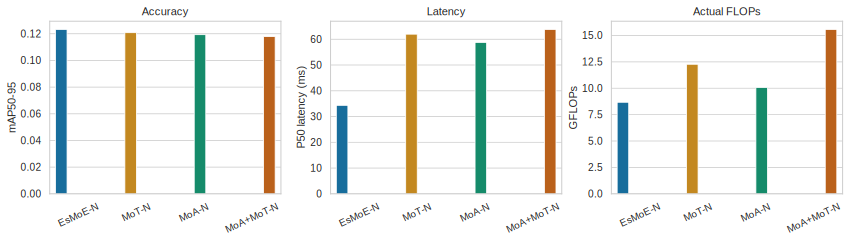
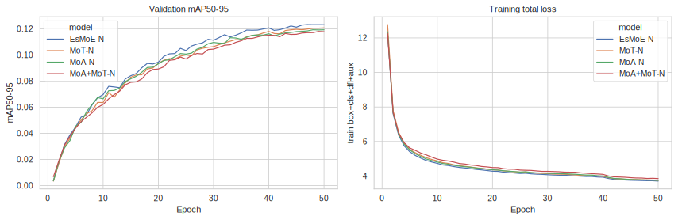
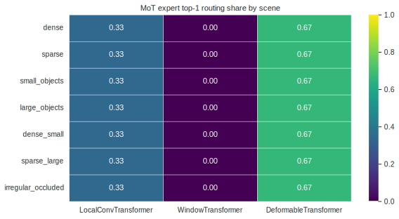
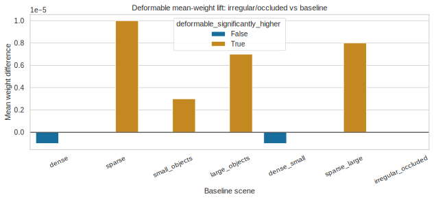

# MoT Hybrid Architecture Ablation

This directory records the **VisDrone 50-epoch MoT hybrid architecture experiment** for **YOLO-Master v0.10**. It answers the issue checklist with completed training logs, benchmark results, MoT routing diagnostics, figures, boundary tests, and a discussion-ready technical summary.

## Artifacts

- `run_visdrone_mot_ablation.sh`: end-to-end training, benchmark, routing, and summary helper.
- `plot_mot_results.py`: rebuilds the CSV tables and Seaborn SVG figures from a completed run directory.
- `results/mot_model_comparison.csv`: final mAP, latency, FLOPs, params, and stability table.
- `results/mot_training_curves.csv`: per-epoch mAP and loss curves from each `results.csv`.
- `results/mot_routing_scenarios.csv`: scene-level MoT expert routing summary.
- `results/mot_deformable_activation_check.csv`: image-level DeformableTransformer activation significance checks.
- `results/figures/*.svg`: Seaborn figures using Arial when available.
- `technical_summary.md`: GitHub discussion-ready technical article.

The completed experiment source directory is:

```text
runs/mot_ablation/visdrone_v10_mot_hybrid_50ep
```

## Experiment Setup

All models were trained on VisDrone for 50 epochs with `imgsz=640`, `device=0`, `workers=8`, and `amp=False`. The required three-way comparison uses:

| Item | Value |
| --- | --- |
| Python version | 3.12.13 |
| Ultralytics version | 8.3.240 |
| PyTorch version | 2.10.0+cu128 |
| GPU | Quadro RTX 6000 |
| GPU memory reported by Ultralytics | 22684 MiB |
| AMP | `False` |
| Image size | 640 |
| Data workers | 8 |
| Benchmark reps | 200 |
| FLOPs method | `torch_profile_actual` |

| Key | Model | Config |
| --- | --- | --- |
| `v10` | YOLO-Master-v0.10-EsMoE-N | `ultralytics/cfg/models/master/v0_10/det/yolo-master-n.yaml` |
| `v10_mot` | YOLO-Master-v0.10-MoT-N | `ultralytics/cfg/models/master/v0_10/det/yolo-master-mot-n.yaml` |
| `v10_moa` | YOLO-Master-v0.10-MoA-N | `ultralytics/cfg/models/master/v0_10/det/yolo-master-moa-n.yaml` |
| `v10_moa_mot` | YOLO-Master-v0.10-MoA+MoT-N | `ultralytics/cfg/models/master/v0_10/det/yolo-master-moa-mot-n.yaml` |

`v10_moa_mot` is the hybrid exploration model: `VisualEnhancedAdaptiveGateMoE` backbone, one `C2fMoA` refinement block, and three `C2fMoT` neck/PAN blocks. 

> The first hybrid attempt hit CUDA OOM at batch 16, **then the completed hybrid run used batch 8**. 
>
> **The other three completed runs used batch 16.** 
>
> Benchmarking was run consistently at `imgsz=640`, `cuda:0`, 200 repetitions, with actual profiler FLOPs (`torch_profile_actual`).

## Final Comparison



| Model | mAP50-95 | mAP50 | P50 ms | P95 ms | P99 ms | GFLOPs | Params M | Final train loss | NaN | Diverged |
| --- | ---: | ---: | ---: | ---: | ---: | ---: | ---: | ---: | --- | --- |
| EsMoE-N | 0.12324 | 0.22356 | 34.355 | 35.184 | 37.371 | 8.671 | 3.450 | 3.70817 | No | No |
| MoT-N | 0.12081 | 0.22248 | 61.971 | 63.168 | 64.935 | 12.270 | 4.055 | 3.75120 | No | No |
| MoA-N | 0.11933 | 0.21697 | 58.788 | 59.924 | 63.708 | 10.072 | 3.577 | 3.74733 | No | No |
| MoA+MoT-N | 0.11789 | 0.21942 | 63.807 | 64.557 | 65.267 | 15.568 | 4.057 | 3.85280 | No | No |

Relative to the EsMoE baseline:

| Model | Delta mAP50-95 | Relative mAP | Delta P50 latency | Relative P50 latency | Relative FLOPs | Synergy decision |
| --- | ---: | ---: | ---: | ---: | ---: | --- |
| MoT-N | -0.00243 | -1.97% | +27.616 ms | +80.38% | +41.50% | No mAP gain and no latency reduction |
| MoA-N | -0.00391 | -3.17% | +24.433 ms | +71.12% | +16.16% | Comparison group is slower and lower mAP |
| MoA+MoT-N | -0.00535 | -4.34% | +29.452 ms | +85.73% | +79.54% | No hybrid synergy |

The issue threshold defines meaningful hybrid synergy as `mAP50-95` improvement greater than 1% or latency reduction greater than 10%. The completed VisDrone run does not meet either condition. EsMoE-N is the best accuracy/latency point in this experiment.

## Training Stability



The completed runs show smooth loss reduction and no final NaN/divergence flags:

- `nan_detected=False` for all four models.
- `loss_diverged=False` for all four models.
- Final total train loss ranges from 3.70817 to 3.85280.
- The only instability recorded in the logs is an engineering OOM during an earlier MoA+MoT batch-16 attempt. It was resolved by rerunning the hybrid with batch 8.

## MoT Routing Diagnosis

MoT routing was measured with `scripts/diagnose_mot_routing.py` on the trained `v10_mot` checkpoint. The script hooks each `MoTBlock.router` and records the token routing distribution for:

- `LocalConvTransformer`
- `WindowTransformer`
- `DeformableTransformer`

Scenes were built from VisDrone label statistics:

- `dense`: high object count.
- `sparse`: low object count.
- `small_objects`: low median box area.
- `large_objects`: high median box area.
- `dense_small`: dense and small-object intersection.
- `sparse_large`: sparse and large-object intersection.
- `irregular_occluded`: proxy group selected by high box scale/aspect-ratio variation.



| Scene | Local top1 | Window top1 | Deformable top1 | Deformable mean weight |
| --- | ---: | ---: | ---: | ---: |
| dense | 0.333 | 0.000 | 0.667 | 0.339506 |
| sparse | 0.333 | 0.000 | 0.667 | 0.339495 |
| small_objects | 0.333 | 0.000 | 0.667 | 0.339502 |
| large_objects | 0.333 | 0.000 | 0.667 | 0.339498 |
| dense_small | 0.333 | 0.000 | 0.667 | 0.339506 |
| sparse_large | 0.333 | 0.000 | 0.667 | 0.339497 |
| irregular_occluded | 0.333 | 0.000 | 0.667 | 0.339505 |

The trained MoT router is nearly scene-invariant in this run. `DeformableTransformer` receives two thirds of top-1 selections in every scene, `LocalConvTransformer` receives one third, and `WindowTransformer` is never the top-1 expert. 

This supports the statement that `DeformableTransformer` is globally preferred by the trained router, but it does not support a scene-specific claim that dense/small or irregular/occluded scenes changed routing behavior in a large practical way.

## Deformable Activation Check



The `DeformableTransformer` check compares `irregular_occluded` against every baseline scene after averaging Deformable activation per image across MoT layers.

| Metric | Baseline | Irregular mean | Baseline mean | Mean diff | Relative lift | One-sided p | Significant flag | Practical reading |
| --- | --- | ---: | ---: | ---: | ---: | ---: | --- | --- |
| top1 share | non-irregular pooled | 0.666667 | 0.666667 | -0.000000 | -0.0000% | 1.0000 | False | No top-1 activation increase |
| mean weight | non-irregular pooled | 0.339505 | 0.339501 | 0.000004 | 0.0013% | 0.0002 | True | Statistically detectable but negligible effect size |
| mean weight | sparse | 0.339505 | 0.339495 | 0.000010 | 0.0029% | 0.0002 | True | Positive but practically tiny |
| mean weight | dense | 0.339505 | 0.339506 | -0.000001 | -0.0002% | 0.8874 | False | No increase |

**Conclusion**: `DeformableTransformer` activation is not meaningfully higher in the irregular/occluded proxy group. 

Some `mean_weight` comparisons are statistically significant because the measured variance is very small, but the effect size is at most about 0.003% relative lift. The issue hypothesis should therefore be reported as not validated by this run.

## Hybrid Architecture Result

The hybrid model was evaluated as `v10_moa_mot`:

- It adds MoA and MoT in the neck/PAN path over the MoE-style backbone.
- It reaches mAP50-95 0.11789, which is 0.00535 below EsMoE-N.
- Its P50 latency is 63.807 ms, which is 29.452 ms slower than EsMoE-N.
- It increases actual FLOPs by 79.54% relative to EsMoE-N.

**This is a negative hybrid result. It is still useful because it rules out this heavy MoA+MoT layout as a VisDrone small-model improvement under the current training recipe.**

## Boundary Tests

`tests/test_mot.py` now covers the required edge cases:

- `MoTBlock` and `_WindowTransformerExpert` when `window_size` is larger than the feature map.
- `_WindowTransformerExpert` shifted-window behavior on odd spatial sizes.
- MoT `exploration_eps` disabled in eval mode, so eval routing remains deterministic/sparse.
- v0.10 MoT and MoA+MoT YAML parse checks.

`tests/test_validator_helpers.py` also covers the standalone validator helper that this branch fixes.

Run:

```bash
MPLCONFIGDIR=/tmp/yolo_master_matplotlib \
python -m pytest \
  tests/test_validator_helpers.py tests/test_mot.py -q
```

Local verification:

```text
15 passed, 1 warning in 3.50s
```

The warning is from a local torchvision image extension and does not affect these tests.

## Scenario Recommendations

1. For VisDrone deployment under this 50-epoch setting, prefer EsMoE-N. It has the best mAP50-95 (0.12324), best P50 latency (34.355 ms), lowest actual FLOPs (8.671 G), and no NaN/divergence flags.
2. Do not use this MoT-N checkpoint as a latency-neutral upgrade. It is stable, but it loses 0.00243 mAP50-95 and adds 27.616 ms P50 latency versus EsMoE-N.
3. Do not claim that WindowTransformer dominates dense or small-object scenes in this run. Its top-1 routing share is 0.000 in every measured scene.
4. Do not claim a meaningful occlusion-specific DeformableTransformer activation rise. Top-1 share has zero lift in `irregular_occluded`; mean-weight lift is statistically detectable in some comparisons but only about 0.0013% against the pooled non-irregular baseline.
5. Avoid the current heavy MoA+MoT hybrid for VisDrone small-model training unless the architecture or training recipe is changed. It is 4.34% relatively lower in mAP50-95 and 85.73% slower at P50 than EsMoE-N.

